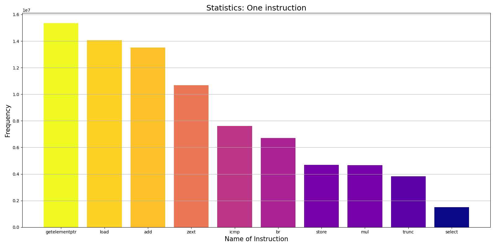
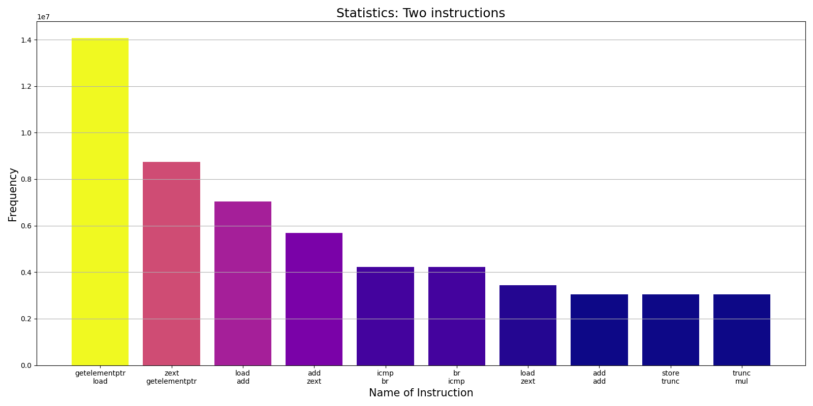
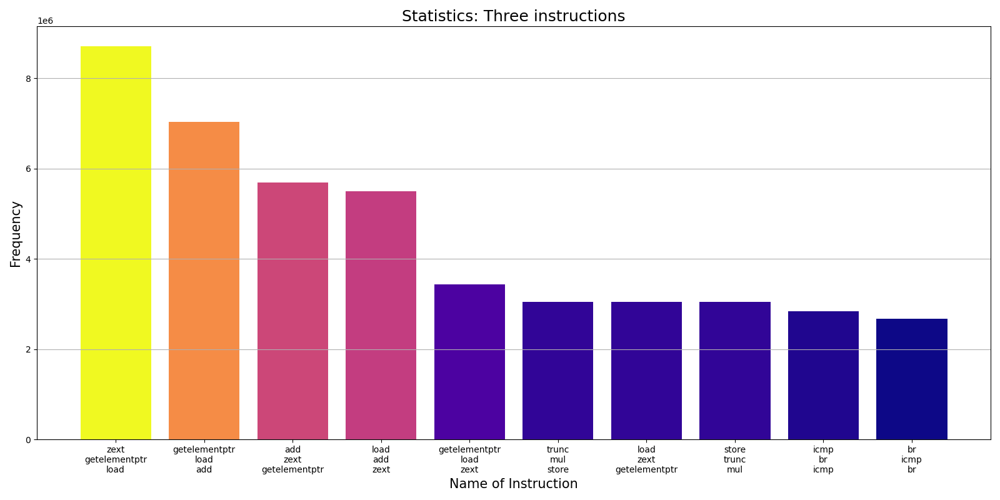
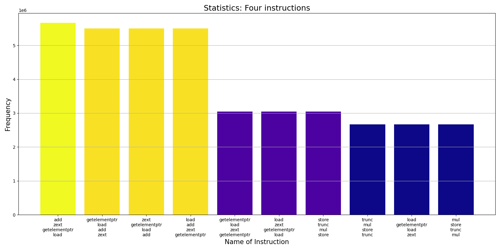
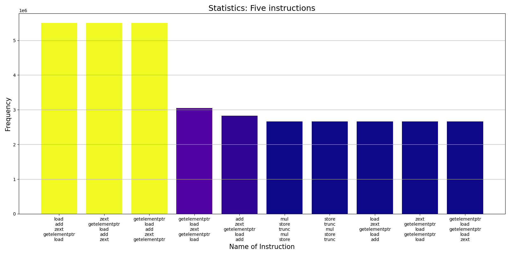
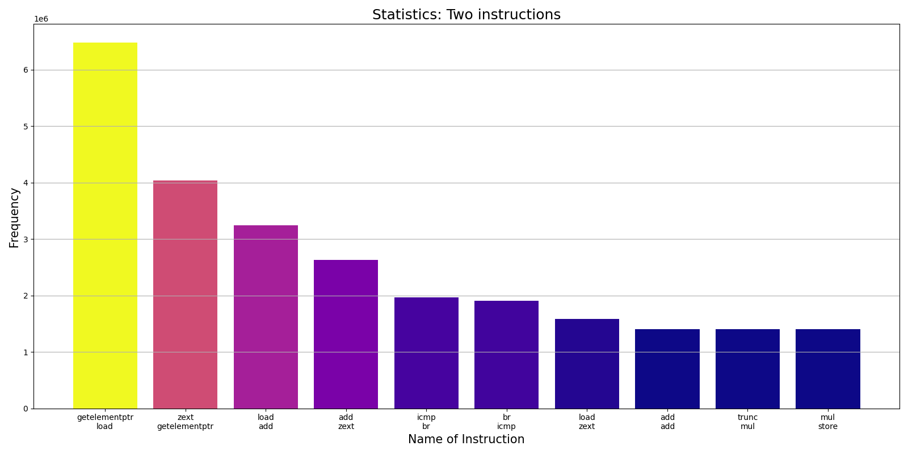
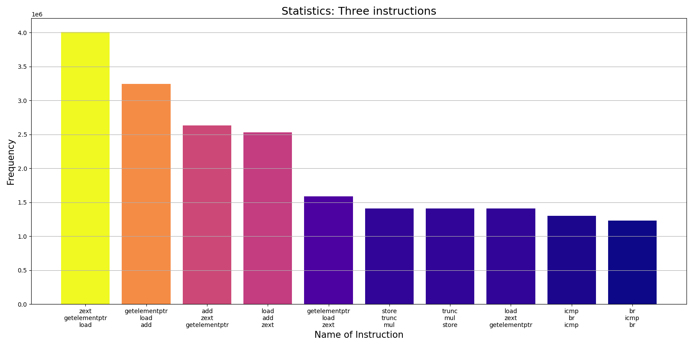
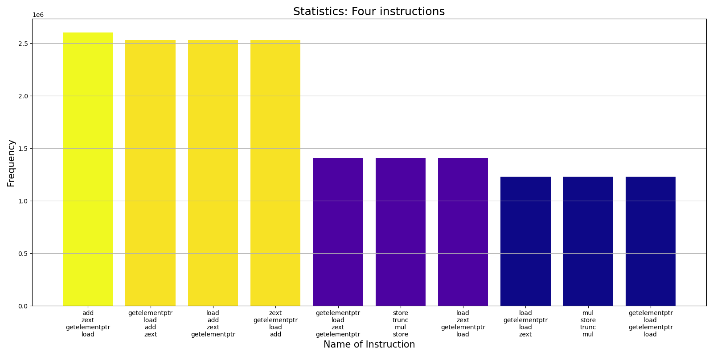

# LLVM Pass example
This is example of LLVM pass that collect static inforamtion about app IR and insert instrumentation for collecting dynamic information.

## Usage:
```
clang++ Pass_cfg.cpp -c -fPIC -I`llvm-config --includedir` -o Pass.o
clang++ Pass.o -fPIC -shared -o libPass.so
clang ../life/app.cc -c -o app.o -Xclang -load -Xclang ./libPass.so -O2 -flegacy-pass-manager
clang ../life/sim.cc log.c app.o -o IR_app -lSDL2
```

## Analyze:
*No: execute __IR_app__ for a short time, or you will analyze __log.txt__ infinitely)*
```
./IR_app > log.txt
python3 analyzer.py log.txt
```

## Results:
No: in __sim.h__ some params _(SIM_X_SIZE -> 200, SIM_Y_SIZE -> 150)_ have been changed to decrease count of instructions


#### Instruction statistics (with O2):







#### Instuction statistics (with O3):




